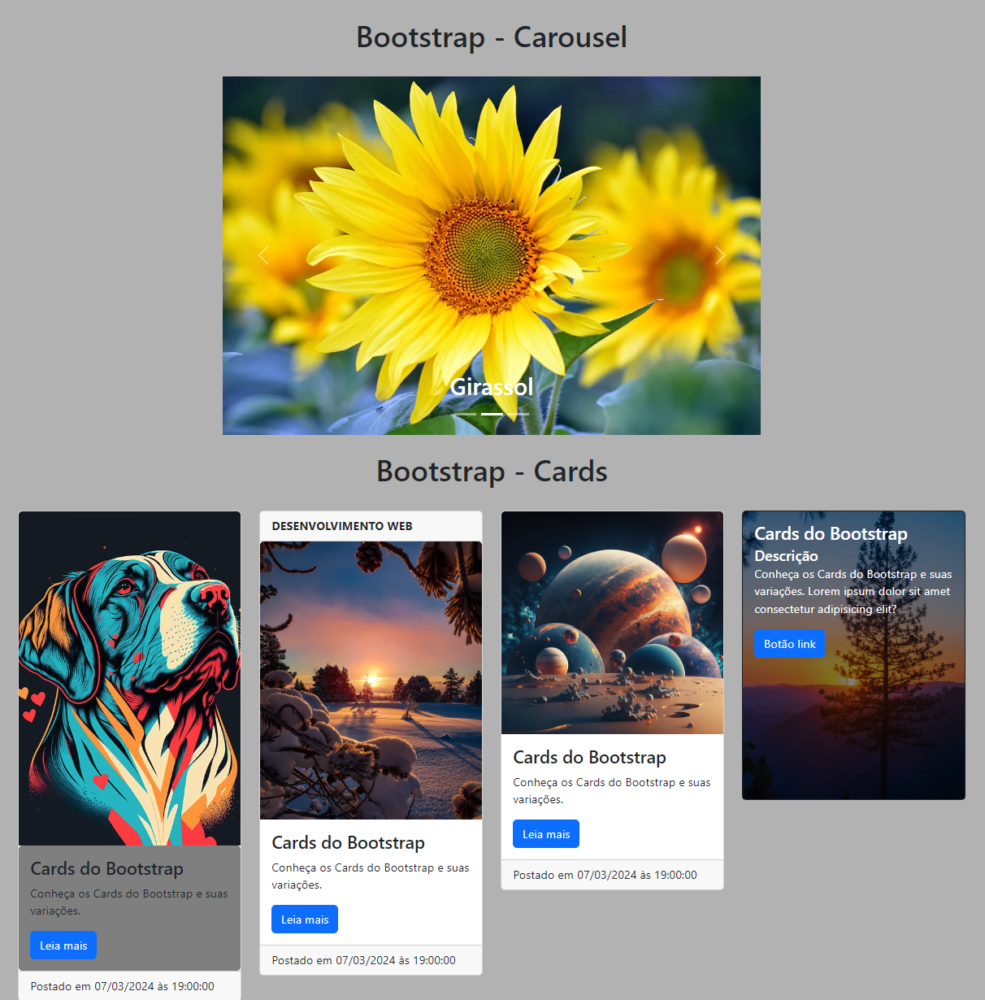

<h1 align="center">Booststrap</h1>

Conhecendo e aprendendo sobre o desenvolvimento de Carousel e alguns modelos de Cards com o Bootstrap.

    
 
    
 
<h2 align="center"> Desenvolvido por:
</h2>

<h3 align="center"> Renata Ribeiro 

 

</h3>
  
