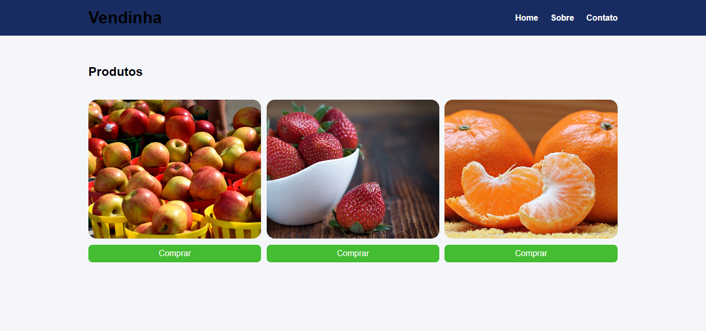

<div align="center">

# Projeto LESS

Este projeto é uma conversão de um arquivo CSS para LESS, utilizando variáveis, mixins e organização modular.

<div style="width: 70%;">



## Estrutura de Arquivos

</div>
</div>

<div style="width: 30%;">

```
projeto/
├── less/
│ ├── base.less
│ ├── variables.less
│ ├── mixins.less
│ ├── media.less
│ └── main.less
├── css/
│ └── main.css
├── index.html
└── README.md
```
</div>


## Como Compilar o LESS

Para compilar os arquivos LESS em um arquivo CSS, e automatizar a atualização, utilize um compilador LESS como o `lessc`. Execute os seguintes comandos no terminal:

```
npm run less

npm run watch-less
```


<div align="center">

## RENATA RIBEIRO

<div style="display: flex; justify-content: center;">
  <a href="https://github.com/rbcribeiro" target="_blank" rel="noopener noreferrer">
    
  </a>

  <a href="https://www.linkedin.com/in/rbcribeiro" target="_blank" rel="noopener noreferrer" style="margin: 15px;">
    
  </a>

  <a href="https://web.dio.me/users/rbcribeiro" target="_blank" rel="noopener noreferrer">
    
  </a>
</div>